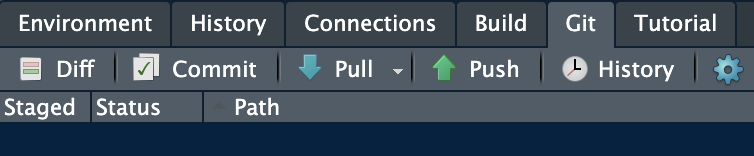
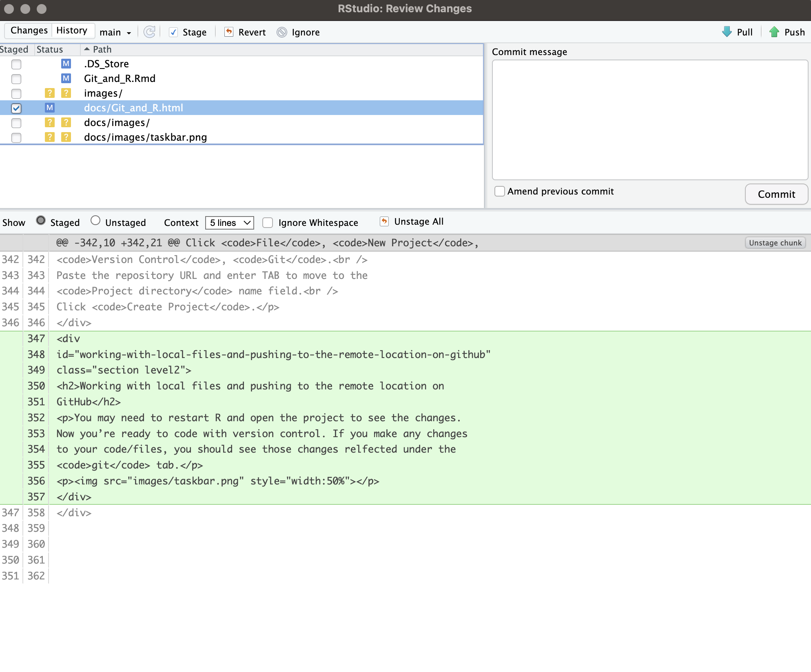

```{r setup, include=FALSE}
knitr::opts_chunk$set(echo = TRUE)
```

# About Version Control  

What is "version control", and why should you care? Version control is a system that records changes to a file or set of files over time so that you can recall specific versions later. This is just a quick overview here, but if you would like to learn more, check out <https://git-scm.com/book/en/v2/Getting-Started-About-Version-Control>.  

If you are a graphic or web designer and want to keep every version of an image or layout (which you would most certainly want to), a Version Control System (VCS) is a very wise thing to use. It allows you to revert selected files back to a previous state, revert the entire project back to a previous state, compare changes over time, see who last modified something that might be causing a problem, who introduced an issue and when, and more. Using a VCS also generally means that if you screw things up or lose files, you can easily recover. In addition, you get all this for very little overhead.

# GitHub and RStudio

RStudio is a popular integrated development environment for R. It integrates the tools you use with R into a single environment. GitHub Pages allows you to host websites directly from your GitHub repository.

In this tutorial, you will learn how to:

* Create a new repository.
* Work with your repository on your local machine using Git and RStudio.
* Use the GitHub.com website to complete the GitHub workflow.
* Publish and share your R Markdown documents using GitHub Pages.

## Prerequisites
For this tutorial you will need an account on [GitHub](https://github.com/).  

If you are new to Git, GitHub and GitHub Pages it is recommended to complete the [GitHub Pages from the command-line course](https://services.github.com/on-demand/github-cli/) first.  

For this tutorial you will use Git and RStudio to work with your GitHub repository.

Download and install [Git](https://help.github.com/articles/set-up-git/).
Download and install [RStudio](https://www.rstudio.com/products/rstudio/download/). (1.1.383 or higher).
Open RStudio.

## Create the remote repository on GitHub

Now that you have what you need installed locally, let’s create the repository that will hold your new website.

On GitHub.com, create a new [repository](https://github.com/new).

Note this tutorial pulls directly from this [tutorial](https://resources.github.com/github-and-rstudio/).  

Name your repository `cars`. You can use a different name.
Enter a description for your repository.  
Choose Public visibility.  
Select Initialize this repository with a `README`.  
Click Add `.ignore` and select `R`.  
Click `Create repository`.

## Clone the repository with RStudio  

After you’ve created a repository on GitHub (the remote repository), the next step is to clone it to your local environment.

On GitHub, navigate to the Code tab of the repository.  
On the right side of the screen, click `Clone` or `download`.  
Click the `Copy to clipboard` icon to the right of the repository URL.  
Open RStudio on your local environment.  
Click `File`, `New Project`, `Version Control`, `Git`.  
Paste the repository URL and enter TAB to move to the `Project directory` name field.  
Click `Create Project`.

## Working with local files and pushing to the remote location on GitHub

You may need to restart R and open the project to see the changes. Now you're ready to code with version control. If you make any changes to your code/files, you should see those changes relfected under the `git` tab.



Here I've opened up the `git` tab and clicked on the `commit` button.



Here you can preview any changes (additions are <span style="color: green;">green</span>, deletions are <span style="color: red;">red</span>). 

You can select which files you would like to commit the changes to (top left) and add any comments that would be helpful to your future self, or any collaborators. For instance, if you added code to run a linear regression analysis you might write something like, "Added glm of SOC vs N to 'soil_nutrient_analysis.R'". These comments are crucial for helping you to make sense of changes you've made through time.

These changes are stored on your local machine. Once you're ready to upload them to your GitHub remote for others to see, you can push the changes by pushing the `push` button. Now others that you've shared your repository with could see those changes online.

If you or someone else has made changes remotely and you'd like to incorporate those changes into your workflow locally, you can use the `pull` button to sync the remote repository with your local one on your computer.

There is so much more to Git, GitHub, and R Studio, but these are the basics: commit, push, and pull.

Now you're ready to code and collaborate with others!
